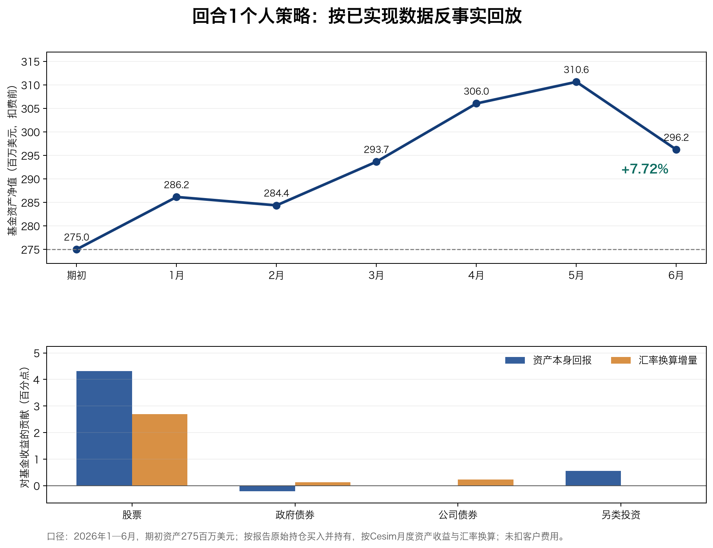

# Cesim Invest 回合1：个人投资策略复盘与反事实回测

**复盘对象：** 2026 年 9 月 27 日《投资策略报告_回合1_V6》记录的马文博个人决策，共 108 个实际持仓，其中股票 82 只。  
**检验区间：** 2026 年 1—6 月，即模拟器回合1的六个月。  
**实际数据：** 2026 年 10 月 8 日从 Cesim 回合1“结果”页面下载的官方 XLS，使用其中逐月资产回报和汇率；小组官方结果也从 Cesim“结果／排名”页核对。课件未用于计算或判断。  
**性质：** 这是将当时已经写定、但未作为小组决策提交的个人持仓，放入已实现市场路径的**反事实回放**。投资组合回报按实际市场数据计算；文中的公司利润则在明确固定其他决策的条件下估算，均不是系统为这套个人持仓出具的官方结果。

## 一、结果先看

若以报告中的 **275.00 百万美元**为期初资产，保持原证券金额买入并持有，按照官网月度证券收益和同期汇率逐月换算，期末约为 **296.22 百万美元**，增加 **21.22 百万美元**，六个月**扣费前美元收益率 +7.72%**。

| 收益来源 | 对基金收益的贡献 |
|---|---:|
| 证券本身的回报（不含汇率换算） | +4.67 个百分点 |
| 外币资产换算为美元的增量 | +3.05 个百分点 |
| **合计，扣费前** | **+7.72%** |

当时报告记录的**毛收益预测为 +3.17%**；在同为扣费前的口径下，回放结果高出约 **4.55 个百分点**。这不能解释为预测能力达到 4.55 个百分点：回放只实现了一条市场路径，其中外币升值贡献很大。

小组最终采用了另一套决策。官网显示本组回合1**扣费后基金回报 −4.12%**。为了校验汇率处理，我另用网站保存的**小组回合1原始持仓**重放：只加权证券回报得到约 −3.90%；加入同期汇率后得到约 **−3.09% 扣费前**，与官网 −4.12% 扣费后之间相差约 1.03 个百分点。这个校验支持下文的美元收益计算口径，但个人方案与小组方案的**毛收益和净收益不能直接相减**；以下复盘专注个人投资策略，不评价其他成员的决策。

官网损益表显示，小组实际提交方案的**本回合公司利润为 −1,485.2 千美元**。若仅将投资持仓换为本报告中的个人方案，沿用小组实际提交的收费、人员、营销、行政和融资决策，并按六个月收费期重算绩效费与所得税，**公司利润约为 +508.8 千美元，较实际结果改善约 1,994.0 千美元**。这是有条件的反事实估计，完整计算见第四节；不能把 21.22 百万美元客户投资收益直接加到公司的利润上。

| 月末 | 模拟资产净值（百万美元） | 当月收益 | 自期初累计收益 |
|---|---:|---:|---:|
| 期初 | 275.00 | — | — |
| 2026 年 1 月 | 286.15 | +4.06% | +4.06% |
| 2 月 | 284.37 | −0.62% | +3.41% |
| 3 月 | 293.65 | +3.27% | +6.78% |
| 4 月 | 306.05 | +4.22% | +11.29% |
| 5 月 | 310.65 | +1.50% | +12.96% |
| 6 月 | 296.22 | **−4.64%** | **+7.72%** |

月末观察到的最大回撤为 **−4.64%**，发生在 5 月末至 6 月末；这不是日内或逐日最大回撤。组合虽然最终盈利，最后一个月仍出现明显回吐，不能只看期末收益。

## 二、哪些决策起了作用

| 资产类别 | 期初金额（百万美元） | 证券回报贡献 | 汇率贡献 | 美元总贡献 | 该类资产美元收益 |
|---|---:|---:|---:|---:|---:|
| 股票 | 199.80 | +4.31 pp | +2.69 pp | **+7.01 pp** | +9.65% |
| 政府债券 | 33.91 | −0.21 pp | +0.13 pp | **−0.08 pp** | −0.66% |
| 公司债券 | 22.00 | ≈0.00 pp | +0.23 pp | **+0.23 pp** | +2.88% |
| 另类投资 | 19.25 | +0.56 pp | 0 | **+0.56 pp** | +8.02% |

*pp 为占期初基金总资产的百分点；逐项四舍五入后可能不完全相加。期初逐项金额合计 274.96 百万美元，约 0.04 百万美元的差额按现金处理。*

**行业选择总体有效，但盈利也有集中来源。** 工业、能源和非周期性消费是报告中的主要主动超配，三者分别贡献 **+2.12、+1.37、+1.56 个百分点**，合计约 **+5.04 个百分点**，约占本次总收益的 65%。它们在期初合计约占基金资产的 50.6%，说明收益并非来自每个行业平均上涨，而是来自几项明确的重仓判断。相同集中度在相反行情下也会放大损失。金融另贡献 **+1.18 个百分点**；科技拖累 **−0.25 个百分点**，原先控制科技仓位减轻了损失。医疗贡献 **+0.28 个百分点**，表明当时对医疗的谨慎配置没有导致明显损失，但也错过了一部分上涨。

**联合信贷的方向判断兑现，原来的因子理由仍要修正。** 该股在官网的六个月证券回报为 **+9.56%**；欧元相对美元升值后，美元回报约 **+15.19%**。原持仓 10.90 百万美元带来约 **1.66 百万美元**盈利，贡献基金收益 **+0.60 个百分点**。这笔增持在结果上成功。不过，“上回合动量 β 为 1.22、高于长期 0.05，所以股价将均值回归”不是有效推导：β 衡量对动量因子收益的敏感度，不是反转概率。官网数据中本回合欧洲动量因子六个月月度收益之和约 **+7.70%**，欧洲价值因子约 **+3.12%**；正动量暴露处于顺风环境，不能用股价上涨反证“β 必须回归”。单股也有无法由四因子完全解释的部分。

**能源观点部分成立，个股差异很大。**能源另类资产的证券回报 **+26.95%**，贡献基金 **+0.27 个百分点**；道达尔和海港能源在美元口径下分别回报约 **+21.85%**、**+14.57%**。BP 的英镑计价证券回报约 **−4.98%**，英镑升值后美元回报约 **−0.05%**，几乎持平。方向押对并不代表板块里每只股票都赚钱，这也是当时分散在多只能源股的价值所在。

**日本国债判断没有按预想兑现，但风险可控。** 日本 10 年期国债证券回报约 **−2.84%**，换算美元后约 **−1.72%**；16.40 百万美元头寸使基金减少约 **0.10 个百分点**。日本政府债券整体贡献约 **−0.07 个百分点**，未变成主要亏损源。日元上涨抵消了部分债券价格损失，但不能把汇率收益当作降息判断正确的证据。下回合若继续持有长久期日本债券，应重新检验利率方向，而不只是沿用上期宏观叙事。

**公司债主要靠汇率提供正贡献。** 公司债证券本身对基金贡献接近零；换算美元后合计贡献 **+0.23 个百分点**。这说明“投资级为主、少量高收益”的配置在本回合稳定了组合，但选债的利率和信用判断并没有产生明显的本币超额收益。不同期限差异值得重看，尤其较长期的欧元投资级债在本币口径下为负。

## 三、汇率是本次复盘不可省略的一层

从 2025 年 12 月末到 2026 年 6 月末，官网汇率序列显示英镑、欧元、瑞郎、日元相对美元分别升值约 **5.19%、5.14%、5.60%、1.15%**。原组合有约 63.6% 资产计价于这些外币，按持仓与各资产收益交互后的汇率增量约 **+3.05 个百分点**。只用“上回合表现”一列直接加权会得到 +4.67%，低估以美元计算的组合回报。

这次多币种分散带来收益，不等于外币敞口本身稳定获利。回头检验此前对美元集中风险的关注是必要的：风险并未消失，而是这一次汇率方向有利。下一轮应把证券观点与货币观点分开列示，避免把英镑或欧元升值产生的收益全部记到选股能力上。

## 四、公司本回合利润：从 −1,485.2 到约 +508.8 千美元

这里的“利润”指**资产管理公司**的本回合税后利润，官网损益表的单位是 **k USD（千美元）**。实际方案的税前利润与本回合利润均为 **−1,485.2 千美元**，原因是亏损时所得税为零。基金资产属于客户；公司从基金取得管理费和绩效费，因而客户投资组合盈利 **21,223.2 千美元**并不意味着公司赚取同等金额。

为单独回答“若按我的持仓投资，公司利润会怎样”，本节只替换投资组合回报，固定小组实际提交的其他决策和已经发生的管理费收入、经营费用、折旧及净融资费用。官网记录的小组费率为**年管理费 1.99%**、**年绩效费 19.99%**；《决策指南》说明费率按年设定、每回合按期限收取，本回合为六个月。因此估算绩效费使用 **19.99% × 6/12 = 9.995%**。实际组合回报为负，本回合费用收入 **2,727.7 千美元**主要对应管理费；对个人组合的 **21,223.2 千美元**扣费前投资收益，按“正的投资收益全额为绩效费计费基数”这一假设计入 **2,121.3 千美元**新增收入。

| 公司损益项目（千美元） | 官网实际结果 | 仅替换个人投资持仓后的估计 | 处理方式 |
|---|---:|---:|---|
| 基金费用收入 | 2,727.7 | **4,849.0** | 原收入固定，加估算绩效费 2,121.3 |
| 员工、营销和行政成本 | 3,641.8 | 3,641.8 | 固定为实际结果 |
| EBITDA | −914.1 | **1,207.2** | 收入减经营成本 |
| 折旧与摊销 | 605.0 | 605.0 | 固定为实际结果 |
| 营业利润 EBIT | −1,519.1 | **602.2** | EBITDA 减折旧 |
| 净融资费用 | −33.9 | −33.9 | 固定为实际结果；负费用使税前利润增加 33.9 |
| 税前利润 | −1,485.2 | **636.1** | EBIT 减净融资费用 |
| 所得税 | 0.0 | **127.2** | 按官网盈利小组约 20% 的有效税率估算 |
| **本回合公司利润** | **−1,485.2** | **约 +508.8** | 税前利润减所得税 |

核算链为：**21,223.2 × 9.995% ≈ 2,121.3** 千美元新增绩效费；**−1,485.2 + 2,121.3 ≈ +636.1** 千美元税前利润；再扣约 **127.2** 千美元所得税，得到**约 +508.8 千美元税后利润**。因此，按这套固定其他条件的估计，利润方向会由亏转盈。

这不是 Cesim 重跑个人方案后的精确利润。官网没有提供“保持已实现市场、客户流动与其他决策不变，只替换历史持仓”并重新结算的功能；更好的基金表现可能改变客户数量和资产管理规模，进而改变管理费、人员成本及绩效费计费基数。绩效费若先扣除固定的 **2,727.7 千美元**管理费才计提，同样固定其他项目时，税后利润约为 **+290.7 千美元**。这两个数字展示了计费基数的影响，**+508.8 千美元是上述主情景估计，不应写成官网实绩**。

## 五、下一轮可沿用的决策纪律

1. 保留“宏观／行业判断 → 单只资产选择 → 仓位与集中度检查”的流程。工业与能源的成功来自具体持仓，但 5 月至 6 月的回撤提醒我们，盈利时也需要看相关头寸在同一冲击下会否一起下跌。
2. 对任何超配单股写清楚可证伪条件。联合信贷的结果为正，但下期是否继续重仓，应看新一轮估值、盈利、因子和市场情景；不应单凭这次赚钱继续加码。
3. 将债券收益拆成利率／信用和汇率两层。本次日本长债的本币表现与原始降息论点相反，公司债本币收益也接近零；这两项需要更新，而不能让外币升值遮盖判断误差。
4. 在预测表中同时记录扣费前投资收益、基金扣费后回报和公司利润。本报告的 +7.72% 是客户资产扣费前回报；约 +508.8 千美元是固定其他条件后的公司利润估计。下回合应分别检验收费、税、客户流动与融资，而不把这三个指标混用。

## 计算口径与可复核文件

对每只资产，以报告记录的期初美元金额买入并持有。月末美元价值＝期初金额 × 各月“1＋证券回报率”的连乘 ×（期初汇率÷当月汇率）。这里的汇率是官网公布的“1 USD＝多少外币单位”；美元资产的汇率因子取 1。组合月末价值为各资产之和加约 0.04 百万美元未投资余额。无月内再平衡。证券月度回报复利后的六个月数值已与网站“上回合表现”逐只核对到两位小数。

可复核材料：[108 个头寸的逐月美元回报与贡献 CSV](./回合1_个人策略反事实回放_逐项归因.csv)和[回合 1 官网结果 XLS（含经济展望预测）](./results-r01_附经济展望.xls)。后者保留 Cesim 原始 `Results` 工作表，并新增预测记录；证券和汇率数据取自原始结果表。官网回合1[“结果 → 关键指标 → 动态”](https://sim.cesim.com/ul/Results?panel=overview-dynamic&sim=iv)显示实际扣费前后基金回报和收费率，[“结果 → 财务报表 → 损益表”](https://sim.cesim.com/ul/Results?panel=income-statement&sim=iv)显示本组实际收入、费用与 −1,485.2 千美元利润；[“决策 → 决策列表”](https://sim.cesim.com/ul/Decisions?panel=decisionchecklist&sim=iv)保留了回合1小组收费决策。[《决策指南》](https://sim.cesim.com/wicket/bookmarkable/com.cesim.invest.manual.InvestManualPage)提供年度费率按回合期限收取的规则。这些官网页面需要登录并选择回合1。原始持仓来自《投资策略报告_回合1_V6》，未在本报告中改动。
