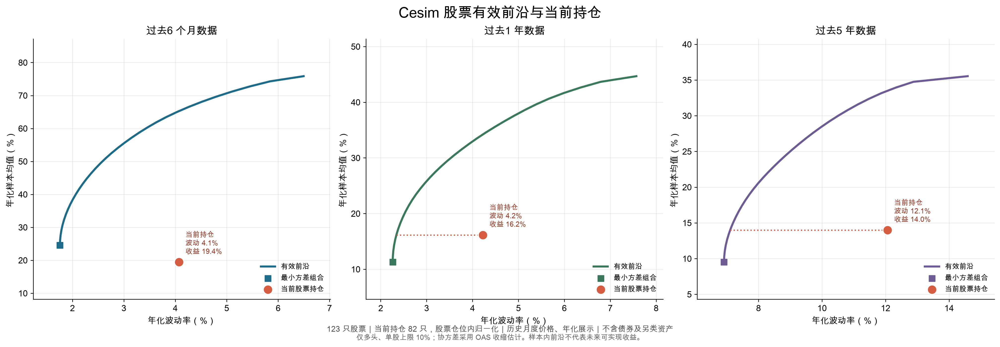

# Cesim Invest 回合1投资策略报告

**决策范围：**第 1 回合，马文博个人投资决策区  
**投资期限：**一个回合为六个月  
**数据时点：**2026 年 9 月 27 日核对的模拟器当前持仓；金额单位为百万美元，另有说明除外  
**报告撰写：**ChatGPT；持仓以马文博最终调整的个人决策为准  
**说明：**以下判断只针对 Cesim 模拟器提供的经济展望、证券数据和本组输入的预测；模拟价格与现实市场价格无关。

## 一、投资结论

本期以股票为主要收益来源，同时用日本政府债券、以投资级为主的公司债及少量另类资产分散风险。最终实际持仓为股票 **72.66%**、政府债券 **12.33%**、公司债券 **8.00%**、另类资产 **7.00%**，约 **0.02%** 未投资。这与股票 72%、政府债券 12%、公司债券 8%、另类资产 8% 的战略配置总体接近，属于在战略框架内表达本期观点。

股票内部采取有选择的主动配置：提高对**工业、能源和非周期性消费**的配置，压低科技、医疗及周期性消费的权重；金融虽然仍低于模拟器基准，但高于医疗。金融内部增持联合信贷银行（UniCredit SpA）至 **10.90 百万美元，占基金约 3.96%**。这一仓位表达了上回合大幅下跌后可能修复的判断，也带来了需要单独管理的个股集中风险。

## 二、组合是如何形成的

本报告由马文博与ChatGPT 撰写。协作从资产配置和初步选股开始：我汇总经济展望、证券数据与组合比例，提出可供讨论的配置思路；马文博则持续指出策略与经济展望或具体证券信息不合理之处，并多次调整仓位。因此，下文解释的是**经过讨论和修订后的实际持仓**，而非最初的一版建议。

几次修订对最终结果有直接影响。马文博提出日本经济疲弱与可能降息的判断，并重新安排政府债券；对照行业展望后，他要求降低医疗、提高金融，同时明确保留对能源的积极配置；查看联合信贷银行的上回合跌幅、预估表现和四因子后，他进一步提高该股仓位。我在这些判断的基础上核对金额和权重、分析债券与股票的风险，并纠正了将动量因子暴露直接理解为股价必然反转的推论。马文博还检查了决策列表中的预算利润，推动我们区分公司利润预测与基金投资收益。最终配置保留了他的行业与个股判断，也纳入了集中度和预测误差的约束。

## 三、宏观与行业判断

模拟器的经济展望显示：美国增长相对稳健，欧洲增长乏力、通胀接近零且面临老龄化，日本经济转弱、失业偏高；全球科技景气虽受新技术叙事推动，短期盈利能力仍有疑问。结合本回合输入的行业估计值，组合采用下列配置。表中权重均占**基金总资产**，不是占股票仓位。

| 行业 | 本回合行业估计值 | 实际股票权重 | 模拟器基准权重 | 配置判断 |
|---|---:|---:|---:|---|
| 工业 | +4.49% | 16.36% | 3.68% | 主要主动超配；看好相对稳健的工业需求，但需承担明显的行业集中风险 |
| 能源 | +0.54% | 16.64% | 11.15% | 保留对能源的积极判断；避免把行业估计值直接当作每只能源股的收益 |
| 非周期性消费 | +5.14% | 17.62% | 13.85% | 倾向需求相对稳定的消费领域 |
| 金融 | −0.12% | 8.51% | 17.56% | 总体仍低配，但高于医疗；重点选择具体银行而非全面押注金融板块 |
| 医疗 | −1.15% | 5.28% | 10.92% | 因本期展望偏弱而下调，仍保留少量行业分散 |
| 科技 | −5.79% | 3.64% | 8.90% | 短期盈利展望谨慎，控制主题性风险 |
| 周期性消费 | −1.41% | 2.84% | 3.88% | 谨慎配置 |
| 基础材料 | −0.74% | 1.78% | 2.04% | 小幅低配 |

工业、能源和非周期性消费合计约 **50.62%** 的基金资产，约占股票持仓的七成。这是本期最重要的主动判断，也意味着组合并非高度分散的股票指数替代品。行业估计值决定配置方向，但不能单独决定权重：估值、个股因子、市场风险、相关性和集中度仍须一起考虑。能源行业估计值只有 +0.54%，但马文博明确看好能源并保留较高仓位；我据此检查了能源股票与另类资产之间的风险重叠，而没有把这一配置解释为行业预测值最高。

## 四、大类资产与债券安排

| 资产类别 | 战略配置 | 页面战术输入 | 最终实际持仓 | 主要用途 |
|---|---:|---:|---:|---|
| 政府债券 | 12.00% | 10.73% | **12.33%** | 利率观点与防御 |
| 公司债券 | 8.00% | 8.00% | **8.00%** | 信用利差与票息收益 |
| 股票 | 72.00% | 74.27% | **72.66%** | 组合主要收益与主动行业选择 |
| 另类资产 | 8.00% | 7.00% | **7.00%** | 分散部分股票和债券风险 |

页面上的战术输入与逐项交易后的实际持仓并不完全相同，尤其股票和政府债券相差约 1.6 个百分点。本报告按最终证券金额计算实际权重；提交前若需保持页面口径完全一致，应再核对战术栏与决策列表，但不应为消除显示差异而无分析地改动证券持仓。

**集中度与汇率。**在复核组合时，马文博特别关注收益是否过度依赖某一只证券、某一行业或某一计价币种。按模拟器当前配置归类，美元资产约占基金 **36.38%**，欧元 **23.93%**、英镑 **20.06%**、日元 **12.08%**、瑞郎 **7.54%**；美元仍是最大币种，但组合没有把绝大多数资金押在同一币种上。多币种配置也会带来汇率波动，不能把它简单视作降低风险。尤其联合信贷占金融股票约 **46.6%**，工业、能源和非周期性消费合计约占基金 **50.62%**：这些主动判断既需要收益理由，也需要仓位上限和下行情景检验。评估任何预估收益较高的方案，都应先看收益是否集中来自少数高度相关的头寸，再决定其是否值得增加风险预算。

**政府债券。**日本国债约 **31.15 百万美元，占基金 11.33%**；美国国债约 **2.76 百万美元，占 1.00%**。日本 10 年期国债为 **16.40 百万美元，占基金 5.96%**，约占日本国债仓位的一半。马文博在审阅日本经济展望后，认为疲弱经济及降息可能性值得更明确的国债配置，并亲自修订了这一部分。我对最终仓位的分析是：若降息带动收益率下行，较长期限国债可能受益；但若降息落空或收益率上行，10 年期久期会放大价格损失。以美元计价时，日元汇率也会影响最终收益。因此，这笔仓位是一项明确的利率判断，并非无风险收益。

**公司债券。**总额 **22.00 百万美元**，其中投资级约 **19.11 百万美元（86.9%）**，高收益债约 **2.89 百万美元（13.1%）**。组合以美元、欧元等货币的投资级 2 年和 5 年期债为基础，少量配置 10 年期欧元投资级债；高收益债保持较小比例。配置公司债需要同时衡量收益率和信用质量、违约及利差风险、期限、货币暴露，并检查是否与股票仓位共同受经济下行冲击。特别是欧洲增长偏弱时，即使预期降息有利于利率端，公司债利差仍可能扩大，所以没有把高收益债作为主要债券仓位。日本企业在疲弱经济中也面临信用风险，故日本公司债仅作小额补充，没有随日本国债同步大幅加仓。

**另类资产。**合计 **19.25 百万美元**，分布于黄金、商品指数、能源、贵金属、白银、工业金属及少量 CesimCoin。它们提供不同于传统股债的风险来源，但能源类另类资产与能源股票、黄金与其他贵金属之间会有重叠，不能把品种数量误认为完全独立的分散。CesimCoin 约占基金 **0.36%**，保持在小规模试探仓位。

## 五、股票选择与四因子：联合信贷银行案例

股票配置不是只把宏观观点转换成行业权重，还要落实到具体证券。当前较大的股票仓位包括 BAE Systems **11.00**、联合信贷银行 **10.90**、BP **10.50**、Exxon **8.96**、Nestlé **8.00**、OMV **8.00** 等百万美元。工业与能源各有多个持仓，但联合信贷银行是金融行业中最需要单独解释的选择：它占金融股票仓位约 **46.6%**，占基金总资产约 **3.96%**，显著高于其模拟器基准的 **0.38%**。

马文博增持联合信贷银行的起点，是核对其上回合约 **−14.16%** 的表现，并看到本回合证券页面给出的MOM β表现，由此提出“下跌后可能修复”的逆向投资假设。他进一步查看了四因子数据；我将这些暴露与长期数值及风险情景作了对照，而没有仅凭上期跌幅推断回报：

| 因子暴露       |    上回合 |     长期 | 对本期判断的含义                         |
| ---------- | -----: | -----: | -------------------------------- |
| 市场 β       |   1.01 |   1.05 | 大体随市场波动，不能把个股上涨完全归因于自身改善         |
| 价值 HML β   |   1.02 |   0.91 | 对价值因子较敏感；价值因子若走弱，预期会受损           |
| 动量 MOM β   |   1.22 |   0.05 | 短期动量因子暴露明显高于长期值，值得追踪，但并不等于股价必然反转 |
| 盈利质量 RMW β |  −1.02 |  −0.83 | 对盈利质量因子呈负暴露，需警惕质量风格变化            |
| α          | −0.01% | +0.09% | 历史超额收益接近零，尚不能证明稳定的选股优势           |

这里对讨论中的“均值回归”直觉作了必要修正：**MOM β 是股票对动量因子收益的敏感度，不是股价跌多后必然上涨的概率。马文博注意到上回合 1.22 与长期 0.05 的差距，这确实提供了进一步核查的线索；但即使该 β 回归，也不能直接推导股价反弹。模拟器当前欧元动量因子的估计收益为 +6.83%，若该假设落空，高动量暴露反而可能拖累预估表现。因此，我将联合信贷的较大仓位解释为结合价格大跌、模型预估和因子情景后的**有风险主动押注**，而非已经被因子证明的套利。保留其他金融股及非金融资产，是对这一判断出错的约束。

## 六、预测结果、风险和下回合复核

模拟器当前显示组合**毛收益预测 3.17%**、**基金净收益预测 1.82%**，决策列表中的**公司预算利润约 4.83 万美元**。这些数字由本回合的经济、行业、因子及费用等输入条件计算，不能当作已经实现的六个月收益。公司预算利润还包含管理费、业绩费、运营成本和融资成本，与投资者的基金收益不是同一个指标。为了提高这项预算利润而集中买入页面预估收益最高的证券，会使组合过度依赖一组可能出错的假设。

下回合应重点复核以下问题，并据此决定是否减仓或再平衡：

1. **联合信贷：**其真实回合收益、四因子暴露及本期 +4.90% 预估是否兑现；如果银行基本面或因子情景恶化，优先检讨这笔接近金融仓位一半的持仓。仅该股票下跌 10%，在其他资产不变时，就会使基金总资产约减少 **0.40 个百分点**。
2. **日本国债：**日本利率是否按预期下降，10 年期债的价格及日元汇率是否共同支持持仓；若利率上行或汇率损失抵消债券收益，应缩短久期或降低集中度。
3. **行业集中：**工业、能源、非周期性消费合计超过基金资产一半；若模拟器下一期展望逆转，不能因当前仓位较大而继续机械加仓。能源股票与能源另类资产还应合并观察。
4. **信用风险：**关注欧洲和日本经济对公司债利差的影响。若利差扩大，高收益债及较长期限公司债的预测回报需要重新估计。

本期策略将马文博对模拟器信息的判断落实为具体持仓，同时为判断失误留下调整空间。下一回合可由马文博以**实际收益相对预测的差异**检验行业选择、债券久期和联合信贷这一逆向仓位；我也可以据此重新计算归因和风险，而不能用事后结果倒推本期每项决策都必然正确。

---

**资料与口径：**Cesim Invest 模拟器中的“经济展望”“投资策略”“证券详情/四因子”“决策列表”和当前个人决策区，核对日期 2026 年 9 月 27 日。所有金额和权重均按当时显示的基金规模 **275 百万美元**及逐项持仓计算，四舍五入可能造成合计的微小差异。行业估计值与证券预估表现是情景输入或模型输出，不是外部独立预测。本文不使用现实市场价格判断模拟证券。

---

## 七、最终持仓明细

以下为马文博个人决策区的回合 1 当前持仓快照，与上文采用同一版本。金额单位为**百万美元**。所有“占基金”比例均以 275 百万美元资产管理规模为分母；股票另列“占股票仓位”，以 199.80 百万美元股票总额为分母。只列实际金额大于零的证券。逐项金额与网页权重均有四舍五入，因此明细求和可能与系统展示值相差约 0.01 个百分点。

| 资产类别 | 持仓金额 | 系统显示占基金 |
|---|---:|---:|
| 股票 | 199.80 | 72.66% |
| 政府债券 | 33.91 | 12.33% |
| 公司债券 | 22.00 | 8.00% |
| 另类资产 | 19.25 | 7.00% |
| 未投资 | 约 0.05 | 0.02% |

### 7.1 股票

共 **82 只**，合计 **199.80 百万美元**。为便于查看主动押注，按行业分组，并在各组内按持仓金额从高到低排列。

**医疗：14.51 百万美元，占基金 5.28%。**

| 股票 | 币种 | 金额 | 占基金 | 占股票仓位 |
|---|:---:|---:|---:|---:|
| Johnson & Johnson 强生 | USD | 3.20 | 1.16% | 1.60% |
| GlaxoSmithKline Pharmaceuticals Limited 葛兰素史克公司 | GBP | 2.15 | 0.78% | 1.08% |
| Ucb SA 优时比公司 | EUR | 1.57 | 0.57% | 0.79% |
| Eli Lilly And Company 礼来公司 | USD | 1.00 | 0.36% | 0.50% |
| Merck & Co., Inc. 默克公司 | USD | 1.00 | 0.36% | 0.50% |
| Pfizer Inc. 辉瑞公司 | USD | 1.00 | 0.36% | 0.50% |
| Abbott Laboratories 雅培公司 | USD | 1.00 | 0.36% | 0.50% |
| Roche Holding AG 罗氏公司 | CHF | 1.00 | 0.36% | 0.50% |
| Novartis AG 诺华公司 | CHF | 1.00 | 0.36% | 0.50% |
| Sanofi SA 赛诺菲公司 | EUR | 1.00 | 0.36% | 0.50% |
| Smith & Nephew plc 史密斯医疗公司 | GBP | 0.59 | 0.21% | 0.30% |

**金融：23.40 百万美元，占基金 8.51%。**

| 股票 | 币种 | 金额 | 占基金 | 占股票仓位 |
|---|:---:|---:|---:|---:|
| UniCredit SpA 联合信贷银行 | EUR | 10.90 | 3.96% | 5.46% |
| ING Groep NV 荷兰国际集团 | EUR | 3.00 | 1.09% | 1.50% |
| Swiss Re AG 瑞士再保险 | CHF | 1.00 | 0.36% | 0.50% |
| Credit Suisse Group AG 瑞士信贷集团 | CHF | 1.00 | 0.36% | 0.50% |
| Banco Santander SA 桑坦德银行 | EUR | 1.00 | 0.36% | 0.50% |
| Deutsche Bank AG 德意志银行 | EUR | 1.00 | 0.36% | 0.50% |
| Societe Generale SA 法国兴业银行 | EUR | 1.00 | 0.36% | 0.50% |
| JPMorgan Chase & Co. 摩根大通 | USD | 0.50 | 0.18% | 0.25% |
| Bank Of America Corporation 美国银行 | USD | 0.50 | 0.18% | 0.25% |
| Wells Fargo & Company 富国银行 | USD | 0.50 | 0.18% | 0.25% |
| American Express Company 美国运通 | USD | 0.50 | 0.18% | 0.25% |
| Citigroup Inc. 花旗集团 | USD | 0.50 | 0.18% | 0.25% |
| Barclays PLC 巴克莱银行 | GBP | 0.50 | 0.18% | 0.25% |
| Standard Chartered PLC 渣打银行 | GBP | 0.50 | 0.18% | 0.25% |
| Zurich Insurance Group AG 苏黎世保险集团 | CHF | 0.50 | 0.18% | 0.25% |
| UBS Group AG 瑞银集团 | CHF | 0.50 | 0.18% | 0.25% |

**科技：10.00 百万美元，占基金 3.64%。**

| 股票 | 币种 | 金额 | 占基金 | 占股票仓位 |
|---|:---:|---:|---:|---:|
| Microsoft Corporation 微软公司 | USD | 3.00 | 1.09% | 1.50% |
| Intel Corporation 英特尔公司 | USD | 3.00 | 1.09% | 1.50% |
| Telecom Italia SpA 意大利电信公司 | EUR | 2.00 | 0.73% | 1.00% |
| BT Group plc 英国电信集团 | GBP | 1.00 | 0.36% | 0.50% |
| Halma Public Limited Company 豪迈公司 | GBP | 1.00 | 0.36% | 0.50% |

**周期性消费：7.80 百万美元，占基金 2.84%。**

| 股票 | 币种 | 金额 | 占基金 | 占股票仓位 |
|---|:---:|---:|---:|---:|
| The Walt Disney Company 沃尔特迪士尼公司 | USD | 1.32 | 0.48% | 0.66% |
| Lowe's Companies, Inc. 劳氏公司 | USD | 1.26 | 0.46% | 0.63% |
| Bayerische Motoren Werke AG 宝马公司 | EUR | 1.00 | 0.36% | 0.50% |
| Continental AG 大陆集团 | EUR | 1.00 | 0.36% | 0.50% |
| Target Corporation 塔吉特公司 | USD | 0.97 | 0.35% | 0.49% |
| McDonald's Corporation 麦当劳 | USD | 0.74 | 0.27% | 0.37% |
| Pearson PLC 培生公司 | GBP | 0.71 | 0.26% | 0.36% |
| NextDecade 公司 | GBP | 0.54 | 0.20% | 0.27% |
| The Swatch Group SA 斯沃琪集团 | CHF | 0.26 | 0.09% | 0.13% |

**非周期性消费：48.45 百万美元，占基金 17.62%。**

| 股票 | 币种 | 金额 | 占基金 | 占股票仓位 |
|---|:---:|---:|---:|---:|
| General Electric Company 通用电气公司 | USD | 8.34 | 3.03% | 4.17% |
| British American Tobacco p.l.c 英美烟草公司 | GBP | 8.00 | 2.91% | 4.00% |
| Nestle S.A. 雀巢公司 | CHF | 8.00 | 2.91% | 4.00% |
| Tesco PLC 乐购 | GBP | 4.00 | 1.45% | 2.00% |
| Walmart Inc. 沃尔玛公司 | USD | 3.67 | 1.33% | 1.84% |
| The Procter & Gamble Company 宝洁公司 | USD | 3.60 | 1.31% | 1.80% |
| The Coca-Cola Company 可口可乐公司 | USD | 2.96 | 1.08% | 1.48% |
| PepsiCo, Inc. 百事公司 | USD | 2.64 | 0.96% | 1.32% |
| L'Oreal SA 欧莱雅公司 | EUR | 1.95 | 0.71% | 0.98% |
| Unilever PLC 联合利华 | GBP | 1.82 | 0.66% | 0.91% |
| Danone SA 达能公司 | EUR | 1.19 | 0.43% | 0.60% |
| Heineken NV 喜力公司 | EUR | 0.87 | 0.32% | 0.44% |
| Jeronimo Martins SGPS SA 杰罗尼莫·马丁斯公司 | EUR | 0.74 | 0.27% | 0.37% |
| Pernod Ricard SA 保乐力加公司 | EUR | 0.67 | 0.24% | 0.34% |

**能源：45.76 百万美元，占基金 16.64%。**

| 股票 | 币种 | 金额 | 占基金 | 占股票仓位 |
|---|:---:|---:|---:|---:|
| BP p.l.c 英国石油公司 | GBP | 10.50 | 3.82% | 5.26% |
| Exxon Mobil Corporation 埃克森美孚公司 | USD | 8.96 | 3.26% | 4.48% |
| OMV AG 奥地利石油公司 | EUR | 8.00 | 2.91% | 4.00% |
| Harbour Energy plc 海港能源公司 | GBP | 7.00 | 2.55% | 3.50% |
| TotalEnergies SE 道达尔能源公司 | EUR | 5.51 | 2.00% | 2.76% |
| Chevron Corporation 雪佛龙公司 | USD | 4.02 | 1.46% | 2.01% |
| Repsol SA 雷普索尔公司 | EUR | 1.77 | 0.64% | 0.89% |

**工业：44.98 百万美元，占基金 16.36%。**

| 股票 | 币种 | 金额 | 占基金 | 占股票仓位 |
|---|:---:|---:|---:|---:|
| BAE Systems PLC 英国航空航天系统公司 | GBP | 11.00 | 4.00% | 5.51% |
| Vinci SA 万喜公司 | EUR | 7.00 | 2.55% | 3.50% |
| Caterpillar Inc. 卡特彼勒公司 | USD | 6.00 | 2.18% | 3.00% |
| The Boeing Company 波音公司 | USD | 5.00 | 1.82% | 2.50% |
| Raytheon Technologies Corporation 雷神技术公司 | USD | 3.00 | 1.09% | 1.50% |
| Acciona SA 阿克西奥纳公司 | EUR | 3.00 | 1.09% | 1.50% |
| Schindler Holding AG 迅达公司 | CHF | 2.89 | 1.05% | 1.45% |
| SGS AG 瑞士通用公证行 | CHF | 2.00 | 0.73% | 1.00% |
| Adecco Group AG 瑞士德科集团 | CHF | 1.00 | 0.36% | 0.50% |
| Schneider Electric SE 施耐德电气公司 | EUR | 0.98 | 0.36% | 0.49% |
| Union Pacific Corporation 联合太平洋公司 | USD | 0.92 | 0.33% | 0.46% |
| RELX PLC 励讯集团 | GBP | 0.80 | 0.29% | 0.40% |
| Abb Ltd ABB公司 | CHF | 0.40 | 0.15% | 0.20% |
| Deere & Company 约翰迪尔公司 | USD | 0.38 | 0.14% | 0.19% |
| Wolters Kluwer NV 威科集团 | EUR | 0.33 | 0.12% | 0.17% |
| Deutsche Lufthansa AG 德国汉莎航空公司 | EUR | 0.28 | 0.10% | 0.14% |

**基础材料：4.90 百万美元，占基金 1.78%。**

| 股票 | 币种 | 金额 | 占基金 | 占股票仓位 |
|---|:---:|---:|---:|---:|
| Rio Tinto Plc 力拓公司 | GBP | 2.31 | 0.84% | 1.16% |
| BASF SE 巴斯夫公司 | EUR | 1.79 | 0.65% | 0.90% |
| Holcim AG 豪瑞公司 | CHF | 0.50 | 0.18% | 0.25% |
| AAR Corp. AAR公司 | USD | 0.30 | 0.11% | 0.15% |

### 7.2 政府债券

| 地区 | 证券 | 币种 | 金额 | 占基金 |
|---|---|:---:|---:|---:|
| 美国 | 1 个月国债 | USD | 0.69 | 0.25% |
| 美国 | 2 年期国债 | USD | 0.69 | 0.25% |
| 美国 | 5 年期国债 | USD | 0.69 | 0.25% |
| 美国 | 10 年期国债 | USD | 0.69 | 0.25% |
| 日本 | 1 个月国债 | JPY | 4.75 | 1.73% |
| 日本 | 2 年期国债 | JPY | 2.50 | 0.91% |
| 日本 | 5 年期国债 | JPY | 7.50 | 2.73% |
| 日本 | 10 年期国债 | JPY | 16.40 | 5.96% |
| **合计** | | | **33.91** | **12.33%** |

### 7.3 公司债券

| 地区 | 信用等级 | 期限 | 币种 | 金额 | 占基金 |
|---|---|---|:---:|---:|---:|
| 美国 | 投资级 | 2 年期 | USD | 5.22 | 1.90% |
| 美国 | 投资级 | 5 年期 | USD | 1.65 | 0.60% |
| 美国 | 高收益 | 2 年期 | USD | 1.38 | 0.50% |
| 英国 | 投资级 | 2 年期 | GBP | 1.93 | 0.70% |
| 英国 | 高收益 | 2 年期 | GBP | 0.82 | 0.30% |
| 日本 | 投资级 | 2 年期 | JPY | 0.69 | 0.25% |
| 日本 | 投资级 | 5 年期 | JPY | 1.37 | 0.50% |
| 瑞士 | 高收益 | 2 年期 | CHF | 0.69 | 0.25% |
| 欧元区 | 投资级 | 2 年期 | EUR | 2.75 | 1.00% |
| 欧元区 | 投资级 | 5 年期 | EUR | 4.12 | 1.50% |
| 欧元区 | 投资级 | 10 年期 | EUR | 1.38 | 0.50% |
| **合计** | | | | **22.00** | **8.00%** |

### 7.4 另类资产

| 资产 | 金额 | 占基金 |
|---|---:|---:|
| 商品指数 | 2.75 | 1.00% |
| 黄金 | 4.50 | 1.64% |
| 能源 | 2.75 | 1.00% |
| 贵金属 | 2.75 | 1.00% |
| 白银 | 2.75 | 1.00% |
| CesimCoin | 1.00 | 0.36% |
| 工业金属 | 2.75 | 1.00% |
| **合计** | **19.25** | **7.00%** |

## 八、历史股票数据的有效前沿：解释边界

**这张图不能用来判断本回合投资决策的优劣。**它只回答一个统计问题：若用历史股票价格估计每只股票的平均收益和协方差，在这些估计值恰好成立、允许重新配置所有股票的条件下，哪些多头组合构成样本内的收益—波动率边界。图中的红点是当前**股票仓位按权重归一化后的结果；政府债券、公司债券和另类资产均未进入计算，因此它也不是整个基金的风险收益位置。

将这条前沿用于 Cesim 下一回合会产生显著的模型偏误。首先，模拟器的下一回合收益由其内部经济、行业、因子及资产层面的情景机制决定，不能将历史价格的样本均值直接当作下一期预期收益。其次，6 个月窗口只有 **6 个**月度收益观测，却要估计 **123 只**股票的协方差；即使用 OAS 收缩估计缓解矩阵不稳定，估计误差仍然很大。最后，前沿是在同一段历史数据上挑出的最优组合，天然带有样本内优化偏差；跨 1 年和 5 年窗口的结果也明显变化。故红点落在前沿下方，只说明**在这套历史样本及模型假设下**存在更优的数学组合，不能推出当前持仓在游戏中必然表现差，更不能据此直接调仓。

计算口径：仅使用工作簿“股价矩阵”的 123 只股票、每只 61 个按月排列的价格点；分别取最近 6、12、60 个简单月收益。收益与波动率均年化展示；协方差采用 OAS 收缩估计。前沿限制为仅多头、单只股票权重不超过 10%，当前组合以 82 只实际持有股票及其金额计算。下表数字是**历史样本统计量**，不是模拟器的本回合收益预测。

| 历史窗口 | 当前股票仓位年化样本收益 | 当前股票仓位年化波动率 | 图中位置 |
|---|---:|---:|---|
| 最近 6 个月 | 19.44% | 4.07% | 低于前沿起点；短样本结果最不稳定 |
| 最近 1 年 | 16.16% | 4.23% | 前沿右侧；同等样本收益下，前沿波动率约 2.34% |
| 最近 5 年 | 13.99% | 12.07% | 前沿右侧；同等样本收益下，前沿波动率约 7.11% |

*持仓来源：Cesim Invest 回合 1 马文博个人决策区“市场”页面，2026 年 9 月 27 日核对。价格来源：施辉整理的《股价历史数据_可编辑(2).xlsx》“股价矩阵”中股票行。历史统计与 Cesim 的预估表现使用不同模型，不能相互替代。*
